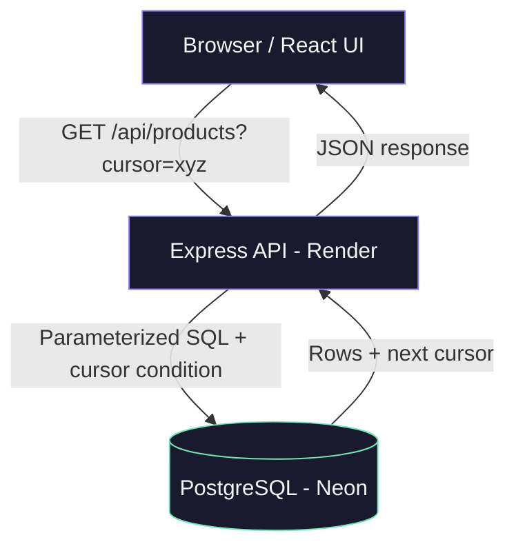
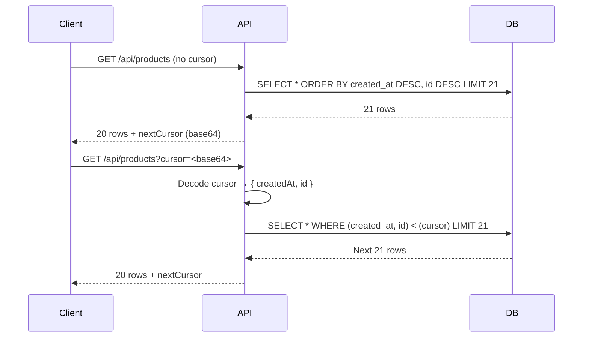

# ProductShelf

A full-stack product browsing application built on cursor-based pagination over 200,000 products.

**Frontend** → https://product-shelf-zeta.vercel.app  
**Backend API** → https://product-browsing-api-49iq.onrender.com  
**Repo** → https://github.com/rahul-singh011/Product-Browsing-API

---

## Architecture



---

## How Cursor Pagination Works



---

## Why Cursor Pagination over OFFSET

| | OFFSET | Cursor |
|---|---|---|
| Performance at 200k rows | ❌ Scans & discards N rows | ✅ Index seek, O(log n) |
| Stable during inserts | ❌ Rows shift, duplicates appear | ✅ Fixed anchor in data |
| Deep page performance | ❌ Gets slower every page | ✅ Constant speed |
| Implementation | Simple | Slightly more complex |

**Proof:** Running `EXPLAIN ANALYZE` on the cursor query shows:
```
Index Scan using idx_products_created_at_id  →  Execution Time: 0.147ms
```
PostgreSQL jumps directly to the cursor position using the compound index instead of scanning all 200,000 rows.

---

## Project Structure

```
Product-Browsing-API/
├── backend/
│   ├── src/
│   │   ├── app.js           # Express setup
│   │   ├── db.js            # PostgreSQL pool
│   │   └── routes/
│   │       └── products.js  # Pagination endpoint
│   ├── scripts/
│   │   └── seed.js          # Bulk insert 200k products
│   └── package.json
└── frontend/
    ├── src/
    │   ├── App.jsx          # Main UI component
    │   ├── App.css          # Styles
    │   └── main.jsx
    └── package.json
```

---

## API Reference

### `GET /api/products`

Browse products with cursor-based pagination.

**Query parameters:**

| Param | Type | Default | Description |
|---|---|---|---|
| `limit` | number | 20 | Products per page (max 100) |
| `category` | string | — | Filter by category name |
| `cursor` | string | — | Opaque cursor from previous response |

**Response:**
```json
{
  "data": [
    {
      "id": 158991,
      "name": "Product 158991",
      "category": "Electronics",
      "price": "4114.51",
      "created_at": "2026-06-23T07:55:12.584Z",
      "updated_at": "2026-06-23T07:55:12.584Z"
    }
  ],
  "pagination": {
    "hasNextPage": true,
    "nextCursor": "eyJjcmVhdGVkQXQiOiIyMDI2...",
    "pageSize": 20
  }
}
```

**Pagination flow:**
1. First request — no cursor needed
2. Check `pagination.hasNextPage`
3. Pass `pagination.nextCursor` as `?cursor=` on next request
4. Repeat until `hasNextPage` is `false`

---

### `GET /api/products/categories`

Returns all distinct category names.

```json
{
  "data": [
    { "category": "Automotive" },
    { "category": "Beauty" },
    { "category": "Books" }
  ]
}
```

---

### `GET /health`

```json
{
  "status": "ok",
  "uptime": 61.59,
  "timestamp": 1782221536956
}
```

---

## Database Schema

```sql
CREATE TABLE products (
  id          SERIAL PRIMARY KEY,
  name        VARCHAR(255) NOT NULL,
  category    VARCHAR(100) NOT NULL,
  price       NUMERIC(10, 2) NOT NULL,
  created_at  TIMESTAMP NOT NULL,
  updated_at  TIMESTAMP NOT NULL
);

-- Primary pagination index
CREATE INDEX idx_products_created_at_id
ON products (created_at DESC, id DESC);

-- Category filter + pagination index
CREATE INDEX idx_products_category
ON products (category, created_at DESC, id DESC);
```

---

## Seed Script

Generates 200,000 products using batched `unnest` inserts — 40 queries of 5,000 rows each instead of 200,000 individual inserts.

```bash
cd backend
node scripts/seed.js
```

**Why batched?**  
Each `INSERT` is one network round-trip to Neon. 200,000 individual inserts ≈ 10 minutes. 40 batched inserts ≈ 30 seconds.

---

## Local Setup

```bash
# Clone
git clone https://github.com/rahul-singh011/Product-Browsing-API.git
cd Product-Browsing-API

# Backend
cd backend
cp .env.example .env
# Add your DATABASE_URL to .env
npm install
node scripts/seed.js
npm run dev

# Frontend (new terminal)
cd ../frontend
npm install
npm run dev
```

---

## Tech Stack

| Layer | Technology |
|---|---|
| Frontend | React, Vite, Axios |
| Backend | Node.js, Express |
| Database | PostgreSQL (Neon) |
| Frontend Deploy | Vercel |
| Backend Deploy | Render |

---

## What I'd Improve With More Time

- **Redis caching** — cache the first page with a short TTL since it's the most requested
- **Full-text search** — PostgreSQL `tsvector` on product names
- **Rate limiting** — `express-rate-limit` to prevent abuse
- **Backward pagination** — support `prevCursor` for browsing back
- **Monitoring** — structured logging and request metrics

---

## How I Used AI

I used Claude as a learning tool throughout — not to generate and paste code, but to understand concepts before writing them.

Specifically:
- It explained why OFFSET pagination breaks on large datasets and how cursor pagination fixes it
- It helped me understand PostgreSQL `unnest()` for bulk inserts
- It explained compound indexes and why field order matters

**What I wrote myself:** every file in this repo — the schema, seed script, pagination query, Express routes, and React UI. AI explained the concepts, I implemented them.

**What I verified myself:**
- Compound index field order `(created_at DESC, id DESC)` must match sort order — wrong order = index not used
- The `LIMIT + 1` trick correctly detects next page without a COUNT query
- Ran `EXPLAIN ANALYZE` to confirm the index is used in production (0.147ms on 200k rows)